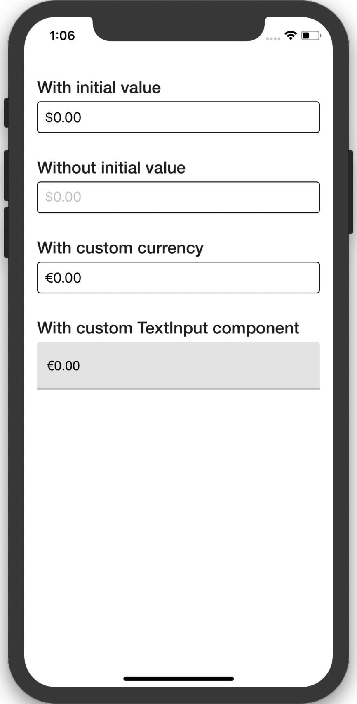

# react-native-amount-input

[](https://www.npmjs.org/package/react-native-amount-input)
[](https://circleci.com/gh/alkafinance/workflows/react-native-amount-input/tree/master)


[](https://github.com/prettier/prettier)
[](https://github.com/semantic-release/semantic-release)

React Native JS-only amount (decimal) input component. Optimized for iOS.



## Getting started

`$ npm install react-native-amount-input --save`

## Usage

Import `AmountInput` and use it more or less like the regular `TextInput` component from React Native core.

```javascript
import {AmountInput} from 'react-native-amount-input';

function MyComponent() {
  return (
    <View>
      <AmountInput
        currency="USD"
        defaultQuantity={defaultQuantity}
        onChangeQuantity={handleChangeQuantity}
      />
    </View>
  );
}
```

## Props

- [Inherited `TextInput` props...](https://facebook.github.io/react-native/docs/textinput.html#props)

- [`currency`](#currency)
- [`defaultQuantity`](#defaultQuantity)
- [`onChangeQuantity`](#onChangeQuantity)
- [`TextInputComponent`](#TextInputComponent)

---

# Reference

## Props

### `currency`

Sets the currency for a fixed symbol prefix in the text input box. Has to be a [ISO 4217](https://www.iso.org/iso-4217-currency-codes.html) currency code.

| Type     | Required |
| -------- | -------- |
| `string` | No       |

### `defaultQuantity`

Provides an initial value that will change when the user starts typing.

| Type     | Required |
| -------- | -------- |
| `number` | No       |

### `onChangeQuantity`

Callback that is called when the entered quantity changes. Changed quantity is passed as a single string argument to the callback handler.

| Type             | Required |
| ---------------- | -------- |
| `number => void` | No       |

### `TextInputComponent`

Sets the base text input component.

| Type               | Required |
| ------------------ | -------- |
| `typeof TextInput` | No       |

## License

[MIT License](./LICENSE) © Alka, Inc
